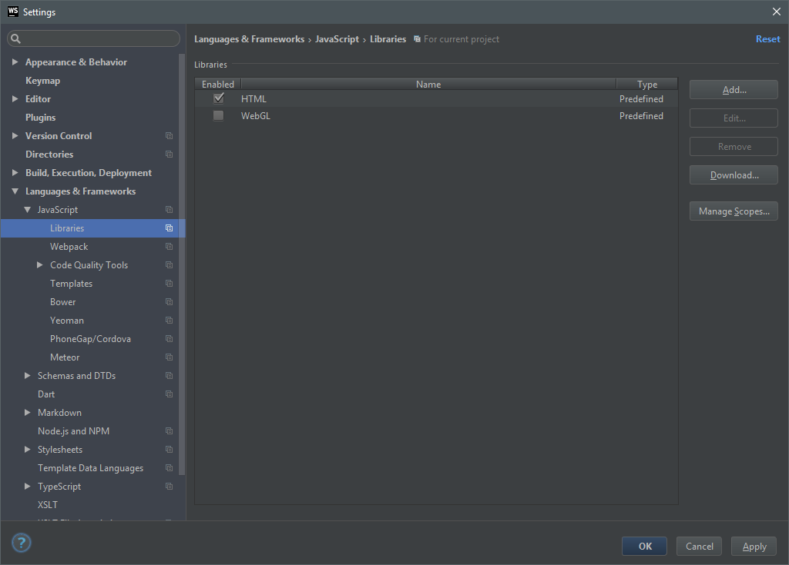
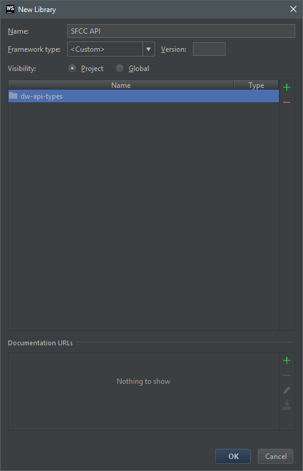
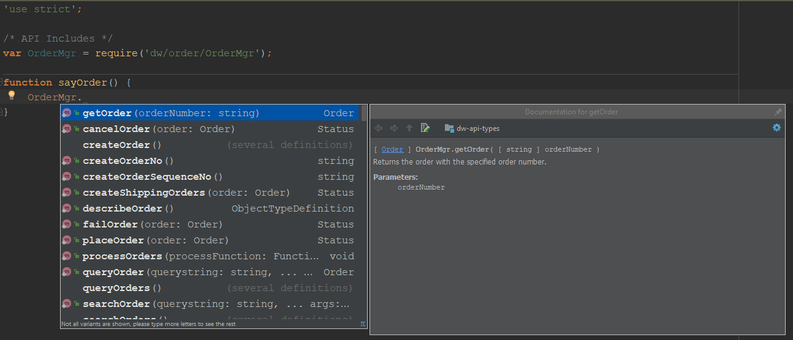

# TypeScript class definitions for Commerce Cloud #

Repo contains TypeScript definitions for internal Commerce Cloud objects (for instance `dw.catalog.Product`)

Definitions are useful for various IDEs (such as WebStorm and VSCode). After typings is setup, IDE will provide better code assistance and type inference. Also, type is useful for writing backend code on TypeScript.

### VS Code Setup ###

* Download and unpack repo content
* Create `jsconfig.json` in your cartridges folder
* Configure `jsconfig.json`. See below for example.
* Replace `/path/to/dw-api-types/` with the path where you are unpacked type definitions are located (see `compilerOptions.paths` and `include`)
* Restart VSCode
* Enjoy enhanced code assistance!


Sample configuration:

```javasciprt
{
    "compilerOptions": {
        "noLib": true,
        "target": "es5",
        "baseUrl": "./",
        "paths": {
            "*" : ["./*", "modules/*", "/path/to/dw-api-types/*"]
        }
    },
    "typeAcquisition": {
        "enable": true
    },
    "include": [
        "/path/to/dw-api-types/**/*.d.ts",
        "./*/cartridge/scripts/**/*.js",
        "./*/cartridge/controllers/**/*.js",
        "./modules/**/*.js"
    ]
}

```

Some time ago VSCode team added support for type validation, thease feature can be enabled via `// @ts-check` on per file basis or via `checkJs` in `jsconfig.json`, so you got linting error based on types


### WebStorm Setup

* Download and unpack repo content
* Open in WebStorm `File / Settings...`
* Go to `Languages & Frameworks / JavaScript / Libraries`



* Click `Add...`
* Give the library a name, like `SFCC API`
* Select the downloaded folder



* OK

### WebStorm Completion

* Create a `*.js` or `*.ds`  file
* Press `<CTRL-SPACE>` to get suggestions



## Contribute

There are many ways to contribute.

* Submit bugs and help to verify fixes as they are checked in.
* Review the source code changes.
* Engage with other users and developers.
* Contribute bug fixes.


## License
Licensed under the current NDA and licensing agreement in place with your organization. (This is explicitly not open source licensing.)
